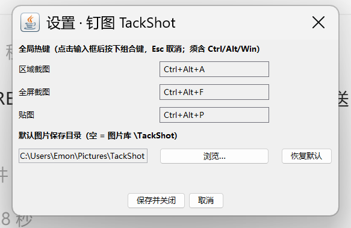
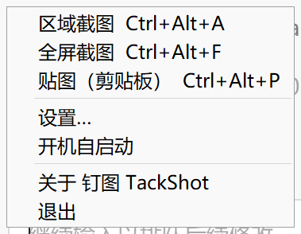

# 钉图 TackShot（AI 版分支）

> **本分支（feature/AI）＝ AI 版主体**：以 GitHub Copilot SDK 接入 AI 识别（OCR / 翻译），产物 `TackShotAI.jar`（身份与配置独立，可与无 AI 旧版同机共存）。
> **main 分支保留无 AI 主版本**；无 AI 版历史快照见 tag `v2.2-noai`。本分支可整体合并回 main（合并即切换为 AI 版）。
> AI 版详细说明（前置条件 / 使用步骤 / 已验证项）见 **[README-AI.md](README-AI.md)**。

**轻量级截图 · 标注 · 贴图工具（AI 版 V2.3-AI，Java 17+）**

[](LICENSE)
[](#)
[](README-AI.md)

绿色免安装：一个文件夹（`TackShotAI.jar` + `lib\` + `start.bat`）就是完整软件，**不含任何 exe**；AI 默认关闭（opt-in），不启用 AI 时行为与无 AI 版一致。

> AI 版运行需 **JDK/JRE 17+**（Copilot SDK 要求）；启用 AI 需自备 GitHub Copilot 订阅、本机安装 Copilot CLI 与访问令牌（详见 README-AI.md）。

---

## 环境要求与快速上手

1. 安装 **JDK 11 或 17**（任一即可，[Adoptium Temurin](https://adoptium.net/) 免费开源）；
2. 下载本仓库 **`release/TackShot` 文件夹**（整个文件夹），双击 **`start.bat`** 启动；
3. 托盘出现图钉图标即常驻成功。

| 动作 | 方式 |
|---|---|
| 区域截图 | `Ctrl + Alt + A` |
| 全屏截图 | `Ctrl + Alt + F` |
| 贴图（剪贴板图片钉到屏幕） | `Ctrl + Alt + P` |
| 确认 / 取消 | `Enter`（或工具条 ✓）/ `Esc` 或右键 |
| 选择工具（选中/移动/缩放标注） | `V` |
| 删除选中的标注对象 | `Delete` |
| 托盘 | 双击 = 截图；右键 = 菜单（设置 / 开机自启等） |


**核心体验**：截图确认后图片**钉在屏幕最前端**（黑色边框标示）；需要进剪贴板时点 **复制** 或 **保存** 按钮——**只有这两个按钮会写剪贴板**，截图/贴图过程绝不覆盖你已复制的内容。

## 功能详解

### 1. 截图


- **自由框选**：拖动框选，拖动中选区白色半透明高亮，实时显示坐标尺寸；松开后 8 控制点微调。
- **窗口吸附**：悬停任意窗口自动高亮（无阴影精确边界），**单击整窗截取**；拖动随时转回自由框选。全程十字光标。
- 多显示器、100%–300% 高 DPI 缩放支持。

### 2. 标注编辑


- **八种标注**：矩形 / 椭圆 / 直线 / 箭头 / 画笔 / 文字（支持输入法）/ 马赛克（3 样式 + 滚轮调粒度）/ 高亮；6 色板 + 3 档线宽；`Ctrl+Z` / `Ctrl+Y` 撤销重做。
- **选择工具（V2.2 新增，`V` 键）**：点击选中任意已画标注——拖动移动、控制点缩放（直线/箭头拖端点、文字拖角改字号）、`Delete` 删除、选中后点色板/线宽直接改该对象；移动/缩放/删除均可撤销。
- **完成动作**：✓ 确认（默认贴图）/ **钉住** / **复制**（入剪贴板+结束，不落盘）/ **保存**（自动保存+复制+结束）/ ✗ 取消。

### 3. 贴图


- 黑色边框标示截图；**置顶可开关**（悬浮菜单按钮：高亮=始终最前，点击切换为允许被其他窗口遮挡，每张贴图独立）；多张贴图共存；**窄贴图窗口自动加宽，悬浮菜单永远完整显示**
- **四角拖拽等比缩放，四边拖拽单轴拉伸**；滚轮缩放
- **透明度**：左键 ◐ 循环 0%→25%→75%→不透明；右键 ◐ 二级菜单（−/+ 步进、点击数字输入百分比）；`Ctrl+滚轮` ±10%；上限 95% 永不隐形
- 悬停浮现悬浮菜单（图片上方）：编辑 · 复制 · 保存 · 缩放 · **置顶** · 透明度 · 关闭
- **就地编辑**：贴图上直接补画标注；编辑工具条同样带 ✓应用 / **复制** / **保存**（输出含标注的合成图并关闭贴图）
- 拖动移动；双击 / `Esc` / 右键关闭

### 4. 设置（V2.1 新增）



托盘右键菜单 → **设置…**：

- **全局热键**：区域/全屏/贴图三项点击录入框后直接按组合键（须含 Ctrl/Alt/Win；重复即时提示）；保存后立即生效，被其他程序占用会气泡提示。
- **默认图片保存目录**：浏览选择或恢复默认（`图片\TackShot`）。



*托盘右键菜单为 Swing 完全自绘——在英文等非中文系统上中文不再是方框。*

### 5. 输出与配置

- 自动保存 PNG（默认）/ JPEG，时间戳命名；目录可在设置窗体中修改。
- 便携配置 `config.json`（与 jar 同目录，也可不经设置窗体直接编辑）：

```json
{
  "hotkey_region":  "Ctrl+Alt+A",
  "hotkey_full":    "Ctrl+Alt+F",
  "hotkey_pin":     "Ctrl+Alt+P",
  "confirm_action": "copy_pin",
  "format":         "png",
  "output_dir":     "",
  "jpeg_quality":   90
}
```

`confirm_action`（确认 ✓ 的动作，**均不写剪贴板**）：`copy_pin`（默认，贴图）/ `copy_save`（自动保存）/ `copy`（按默认贴图处理）

## 隐私

本软件**完全离线运行**：不联网、不上传、不收集任何数据。开机自启动默认关闭，仅在你从托盘菜单开启后写入注册表 HKCU Run。

## 常见问题

**Q：双击 start.bat 没有反应？**
bat 会检测 `javaw`：请确认已安装 JDK/JRE 11/17 且在 PATH 中（或设置了 `JAVA_HOME`）。仍不行时，把 bat 里的 `javaw` 改成完整路径，例如 `"C:\Program Files\Java\jdk-17\bin\javaw.exe"`。

**Q：公司电脑禁止运行 exe？**
本发行包**不含任何 exe**（jar + bat），JRE 由公司 IT 统一安装的白名单 `java.exe/javaw.exe` 承载运行，无 SmartScreen/杀软 exe 拦截问题。

**Q：英文系统上中文显示方框？**
V2.0.2 起全部 UI 字体按已装字体探测回退，V2.0.4 起托盘菜单改为完全自绘——中英文系统均正常显示。

**Q：内存占用？**
Java 版常驻约 60–120MB（启动参数已限 `-Xmx128m`）。相比 C++ 版（约 12MB）是运行时代价的交换——换来的是免 exe 的合规运行环境。

## 构建

需要 JDK 11+（11/17 均可）：

```bash
bash build.sh                     # 产物 dist/TackShot.jar，并组装 release/ 发行文件夹与 zip
java -jar dist/TackShot.jar --test  # 冒烟自测（3 项）
```

技术栈：Java 11 + Swing/AWT + JNA 5.14（Apache-2.0，见 [THIRD-PARTY-NOTICES.txt](THIRD-PARTY-NOTICES.txt)；许可证 MIT，见 [LICENSE](LICENSE)）。

需求规格说明书（含功能跟踪表 RTM）见仓库根目录 `需求文档.html`。

## 联系作者

邮箱：**emonzhang3438@outlook.com** —— 欢迎大家提出新的需求和 Bug 报告，也欢迎功能讨论与代码贡献。

---

# English Documentation

# TackShot — Snap, Annotate, Pin (Java V2.2)

**A lightweight screenshot, annotation and pin tool for Windows — now in Java.**

A single portable folder (`TackShot.jar` + `lib\` + `start.bat`) — **no exe at all**, ideal for locked-down corporate machines. Fully offline: no ads, no telemetry.

> Since V2.0 the implementation is **Java 11+ (Swing/AWT + JNA)**; install JDK/JRE 11 or 17 to run.

## Quick Start

1. Install **JDK 11 or 17** (e.g. [Adoptium Temurin](https://adoptium.net/));
2. Download the **`release/TackShot` folder** from this repo and double-click **`start.bat`**;
3. The pin icon in the tray means it's running.

| Action | How |
|---|---|
| Region capture | `Ctrl + Alt + A` |
| Fullscreen capture | `Ctrl + Alt + F` |
| Pin clipboard image | `Ctrl + Alt + P` |
| Confirm / Cancel | `Enter` (or ✓) / `Esc` or right-click |
| Select tool (select/move/resize objects) | `V` |
| Delete selected object | `Delete` |
| Tray | Double-click to capture; right-click for menu (Settings / auto-start …) |


**Core idea**: confirming a capture **pins it on top** (black border). The clipboard is only touched when you click **Copy** or **Save** — capturing and pinning never overwrite what you've already copied.

## Features

- **Capture** — free-region selection with white veil + live readout + 8 handles; window snap (shadow-excluded bounds, click to capture); multi-monitor, 100%–300% DPI.
- **Annotate** — rect / ellipse / line / arrow / pen / text (IME) / mosaic (3 styles + wheel granularity) / highlight; 6 colors × 3 widths; undo/redo; `R O L A B T M H` hotkeys.
- **Select tool (new in V2.2, `V`)** — click any drawn object to select it: drag to move, handles to resize (lines/arrows drag endpoints, text corners scale the font), `Delete` to remove; palette/width edit the selected object directly; every operation is undoable.
- **Finish actions** — ✓ confirm (pin by default) / **Pin** / **Copy** (clipboard + close, no file) / **Save** (auto-save + copy + close) / ✗ cancel.
- **Pin** — black border; **per-pin always-on-top toggle** in the hover menu; corner = proportional resize, edge = single axis; wheel zoom; opacity ◐ (cycle / sub-menu / Ctrl+wheel, 95% cap); hover menu that always fits; **edit in place** — the pin edit toolbar also has Copy/Save (outputs the annotated composite and closes the pin); drag / double-click / Esc to close.
- **Settings (new in V2.1)** — tray menu → Settings: capture-press hotkey remapping (Ctrl/Alt/Win required, conflict feedback) and default save folder.


*The tray menu is fully self-drawn with Swing — Chinese renders correctly even on non-Chinese Windows.*

- **Output** — auto-save PNG/JPEG, timestamped names; portable `config.json` (`confirm_action`: `copy_pin` = pin only by default / `copy_save` = auto-save / `copy` = treated as pin — none of them touch the clipboard).

## Privacy

Fully offline. Auto-start is opt-in (HKCU Run, off by default).

## FAQ

- **start.bat does nothing** — ensure JDK/JRE 11/17 is installed and `javaw` is on PATH (or `JAVA_HOME` set); or edit the bat to point at `javaw.exe` directly.
- **exe blocked by policy** — this package ships no exe; the whitelisted corporate `javaw.exe` hosts the app.
- **Chinese shows as boxes on English Windows** — fixed since V2.0.2/V2.0.4 (font-fallback probing + fully self-drawn tray menu).
- **Memory** — ~60–120MB idle (`-Xmx128m` preset); the trade for an exe-free environment.

## Build

```bash
bash build.sh                          # builds dist/TackShot.jar and assembles release/ + zip
java -jar dist/TackShot.jar --test     # smoke test (3 checks)
```

Stack: Java 11 + Swing/AWT + JNA 5.14 (Apache-2.0 — see [THIRD-PARTY-NOTICES.txt](THIRD-PARTY-NOTICES.txt); MIT License — see [LICENSE](LICENSE)).

## Contact

Email: **emonzhang3438@outlook.com** — feature requests and bug reports are warmly welcome!

---

## 更新日志 / Changelog

### V2.2（2026-08-24）

**新增 / New**

- 选择工具（`V`）：八类标注全可选中、移动、缩放、删除（FR-3.10）——直线/箭头拖端点，文字拖角改字号，选中后可直接改色与线宽
- Select tool (`V`): all 8 annotation types can be selected, moved, resized and deleted (FR-3.10) — lines/arrows drag endpoints, text corners scale the font, palette/width edit the selection directly
- 图标重画：保存=软盘、钉住=钉子（文案"贴图"→"钉住"）
- Icon redesign: Save = floppy disk, Pin = nail (tooltip renamed)

**改进 / Improved**

- 撤销升级为快照式：移动/缩放/删除/改属性全部可 `Ctrl+Z`
- Undo is now snapshot-based: move/resize/delete/restyle are all undoable

### V2.1（2026-08-24）

**新增 / New**

- 设置窗体（托盘 → 设置…）：热键点击录入式自定义 + 默认保存目录（FR-7.1/7.2/2.2）
- Settings dialog (tray → Settings): press-to-record hotkey remapping + default save folder
- 截图工具条新增"复制"按钮；贴图编辑态新增"复制 / 保存"按钮——两个编辑界面都可随时固定当前状态（FR-3.11/4.8）
- Copy button in the capture toolbar; Copy/Save buttons in the pin edit toolbar — freeze the current state anytime in either editor (FR-3.11/4.8)

### V2.0.1–V2.0.3（2026-08-23）

**修复 / Fixed**

- 剪贴板复制对外无效：CF_DIB 常量误写为 CF_BITMAP(2)，外部程序（Paint/微信/浏览器等）全部无法粘贴——修正为 8 并加忙重试
- Clipboard copy was broken externally: the CF_DIB constant was mistakenly 2 (CF_BITMAP), so Paint/WeChat/browsers could not paste — fixed to 8 with busy-retry
- 英文等非中文系统托盘菜单中文方框：字体探测回退 + 托盘菜单改为 Swing 完全自绘（FR-6.8）
- Chinese showed as boxes in the tray menu on non-Chinese Windows: font-fallback probing + a fully self-drawn Swing tray menu (FR-6.8)
- 英文系统 UI 字体回退：雅黑缺失时自动改用 Noto/思源/宋体等已装中文字体
- UI font fallback on English systems: auto-switch to Noto/Source Han/SimSun etc. when YaHei is absent

**新增 / New**

- 贴图置顶开关（悬浮菜单按钮，可被其他窗口遮挡/恢复最前，FR-4.2）
- Per-pin always-on-top toggle in the pin hover menu (FR-4.2)

**变更 / Changed**

- 剪贴板写入时机收窄：**仅"复制"/"保存"按钮写剪贴板**，确认（✓/Enter/双击）、贴图、编辑完成均不再覆盖剪贴板（FR-4.11 裁剪，用户决策）
- Clipboard writes narrowed to the **Copy/Save buttons only** — confirm (✓/Enter/double-click), pin and edit-finish no longer overwrite your clipboard (FR-4.11 descoped by user decision)

---

© 2026 钉图 TackShot 贡献者 · MIT License
