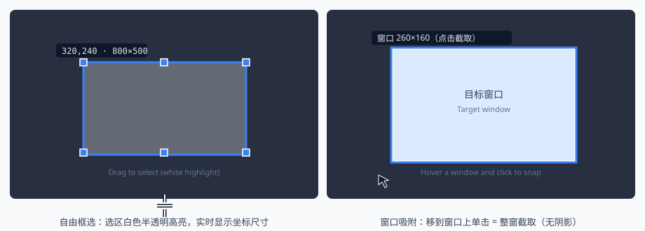
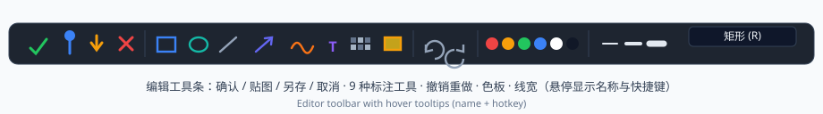
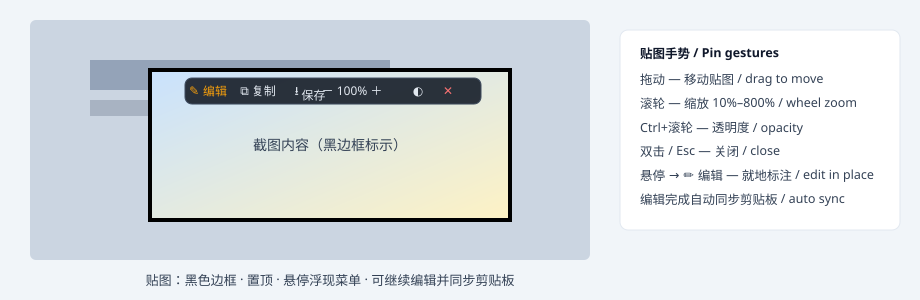

# 钉图 TackShot

**轻量级截图 · 标注 · 贴图工具** / *Lightweight screenshot · annotation · pin tool for Windows*

[](LICENSE)
[](#)
[](#隐私--privacy)

单一可执行文件，解压即用，无需安装任何运行库；空闲驻留内存约 12MB；完全离线，无广告、无遥测。

*Single portable executable — no installer, no runtime dependencies. ~12 MB idle memory. Fully offline, no ads, no telemetry.*

---

## 快速上手 / Quick Start

| 动作 / Action | 方式 / How |
|---|---|
| 区域截图 / Region capture | `Ctrl + Alt + A` |
| 全屏截图 / Fullscreen capture | `Ctrl + Alt + F` |
| 贴图（剪贴板图片钉到屏幕）/ Pin clipboard image | `Ctrl + Alt + P` |
| 确认 / Confirm | `Enter` 或工具条 ✓ |
| 取消 / Cancel | `Esc` 或右键 |
| 托盘 / Tray | 双击 = 截图；右键 = 菜单（开机自启等）/ double-click to capture, right-click for menu |


**核心体验 / Core experience**：截图确认后，图片**自动复制到剪贴板**，同时**钉在屏幕最前端**（黑色边框标示）——去任意应用 `Ctrl+V` 直接粘贴，或在贴图上继续编辑。

*After confirming, the image is **automatically copied to clipboard AND pinned on top** — paste anywhere, or keep editing on the pin.*

---

## 功能详解 / Features

### 1. 截图 / Capture



- **自由框选 / Free region**: 拖动鼠标框选。拖动过程中选区以**白色半透明高亮**显示，与黑色遮罩形成鲜明对比；实时显示坐标与尺寸；松开后可用 8 个控制点微调。
  *Drag to select — the region glows translucent white against the dark mask, with live size/position readout and 8 resize handles after release.*
- **窗口吸附 / Window snap**：鼠标移到任意窗口上会自动高亮该窗口（不含阴影的精确边界），**单击即整窗截取**；按住拖动则随时转回自由框选。
  *Hover any window to highlight it (shadow-excluded bounds), click to capture the whole window; drag to fall back to free selection.*
- 多显示器、100%–300% 高 DPI 缩放支持 / multi-monitor & high-DPI ready.

### 2. 标注编辑 / Annotate



矩形 / 椭圆 / 直线 / 箭头 / 画笔 / 文字（支持输入法）/ 马赛克 / 高亮；6 色板 + 3 档线宽；`Ctrl+Z`/`Ctrl+Y` 撤销重做；工具快捷键 `R O L A B T M H`；悬停任意按钮显示功能名与快捷键。

*Rectangle, ellipse, line, arrow, pen, text (IME support), mosaic, highlight; 6-color palette; undo/redo; one-key tool switching; hover any button for a tooltip with its name and hotkey.*

### 3. 贴图 / Pin



- 黑色边框明确标示"这是一张截图" / **black border** clearly marks the screenshot
- 始终置顶 / always on top；多张贴图共存 / multiple pins
- 悬停浮现悬浮菜单：编辑 · 复制 · 保存 · 缩放 · 透明度 · 关闭
  *Hover to reveal the floating menu: edit, copy, save, zoom, opacity, close.*
- **就地编辑**：贴图上直接补画标注，完成后自动同步回剪贴板（贴图上看到的 = 粘贴出去的）
  *Edit in place — annotations are automatically synced back to the clipboard.*

### 4. 输出与配置 / Output & Configuration

- 自动保存：PNG（默认）/ JPEG，时间戳命名，目录可在配置中修改 / auto-save as PNG/JPEG with timestamped names
- 另存为对话框 / save-as dialog
- 便携配置：`config.json` 与 exe 同目录，改热键、输出行为无需界面：

```json
{
  "hotkey_region":  "Ctrl+Alt+A",
  "hotkey_full":    "Ctrl+Alt+F",
  "hotkey_pin":     "Ctrl+Alt+P",
  "confirm_action": "copy_pin",
  "format":         "png",
  "output_dir":     "",
  "jpeg_quality":   90
}
```

`confirm_action`：`copy_pin`（默认，复制+贴图）/ `copy`（仅复制）/ `copy_save`（复制+自动保存）

## 隐私 / Privacy

本软件**完全离线运行**：不联网、不上传、不收集任何数据。开机自启动默认关闭，仅在你从托盘菜单开启后写入注册表 HKCU Run。

*TackShot is fully offline: no network, no uploads, no telemetry. Auto-start is opt-in only.*

## 下载与使用 / Download & Run

从 [Releases](https://github.com/Emon9426/TackShot/releases) 下载 `TackShot-win64.zip`，解压得到一个 `TackShot` 文件夹——**这个文件夹就是完整软件**，双击 `TackShot.exe` 即可。删除文件夹即完全卸载。

*Download `TackShot-win64.zip` from Releases, extract, and run `TackShot.exe`. The folder is the whole app — delete it to uninstall completely.*

## 构建 / Build

需要 MinGW-w64 GCC（x64）。仓库根目录执行 / with any MinGW-w64 toolchain:

```bash
bash build.sh     # 产物 dist/TackShot.exe，并组装 release/ 发行文件夹与 zip
./dist/TackShot.exe /test   # 冒烟自测 / smoke test
```

技术栈：C++20 + Win32 + GDI+，零第三方依赖（MIT 许可证，见 [LICENSE](LICENSE) 与 [THIRD-PARTY-NOTICES.txt](THIRD-PARTY-NOTICES.txt)）。

## 需求与路线 / Requirements & Roadmap

需求规格说明书（含功能跟踪表 RTM）见仓库根目录 `需求文档.html`。*Full requirements spec (with traceability matrix) in `需求文档.html`.*

---
© 2026 钉图 TackShot 贡献者 · MIT License
